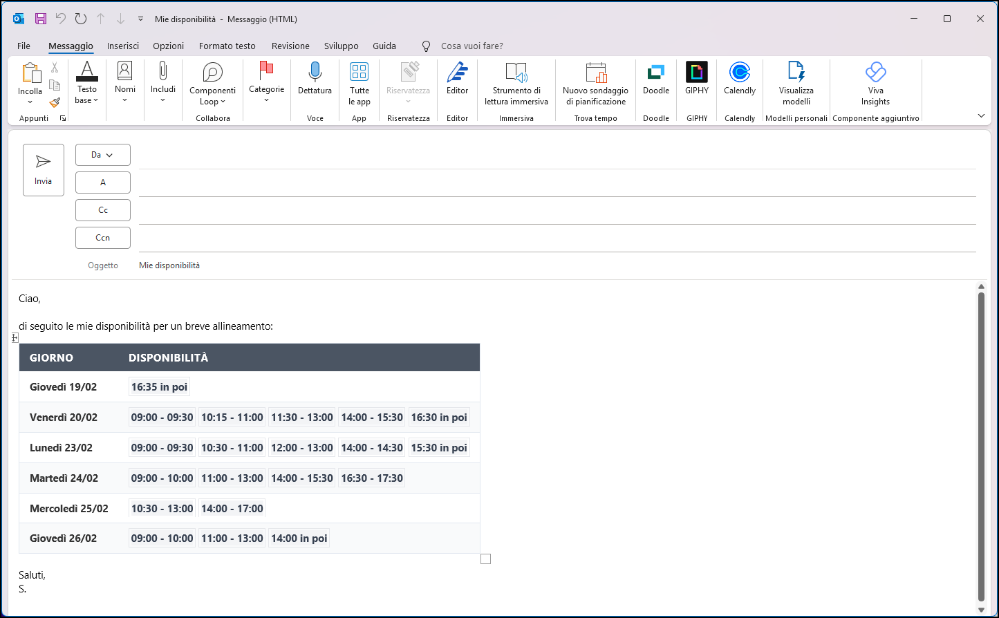
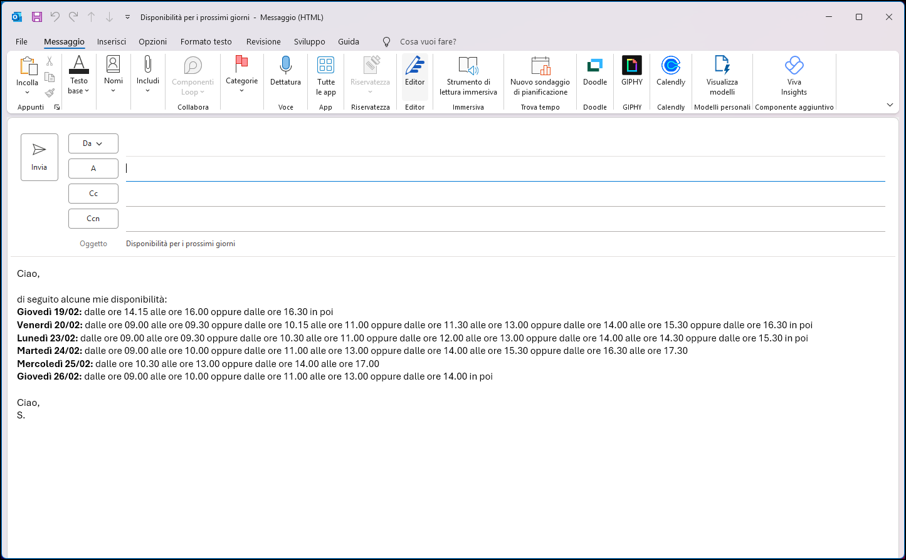

# 📅 Outlook Free Slot Generator

A specialized utility to scan your Outlook calendars (supporting multiple accounts) and automatically generate a new email containing your availability. This tool helps you schedule meetings efficiently without exposing your entire calendar.

The generator accounts for your working hours, lunch breaks, and personal preferences, all defined in a simple configuration file.

## 🚀 Key Features
* **Unified Script Engine**: A single core script (`outlook-free-slot-generator.ps1`) manages all logic via parameters.
* **Multi-Calendar Scanning**: Aggregate availability from several email accounts at once by listing them in the config.
* **Dual Output Modes**: Choose between a **styled HTML table** for professional emails or **clean text** for quick updates.
* **Full Automation**: The script **automatically creates a new Outlook email** with the subject and body already populated.
* **Portable & Secure**: Uses `.bat` wrappers to bypass execution policies—runs on Windows machines with Outlook installed without needing Admin rights.

---

## 🖥️ Preview & Usage

The tool is now more versatile. You can trigger different formats using the dedicated launchers:

### 1. Table Mode (HTML)
Ideal for a professional look. This mode creates a new email featuring a color-coded table with modern "badges" for time slots.

**How to generate:**
* Double-click `outlook-free-slot-generator-table.bat`.
* This executes: `.\outlook-free-slot-generator.ps1 -Formato Tabella`.
* **Wait a second:** A new Outlook email window will automatically pop up with the table inside.



### 2. Text Mode
Best for quick replies, simplified communication, or mobile-friendly viewing.

**How to generate:**
* Double-click `outlook-free-slot-generator-text.bat`.
* This executes: `.\outlook-free-slot-generator.ps1 -Formato Testo`.
* A new Outlook email window will open automatically with the availability listed as clean, bolded text.



---

## ⚙️ Configuration
Open `config.json` to customize the tool. You can define your working routine and localization settings:

```json
{
    "CalendarsToRead": ["name.surname@company.com"],
    "WorkingHours": { "Start": 9, "End": 18 },
    "LunchBreak": { "Start": 13, "End": 14 },
    "Preferences": {
        "DaysForward": 5,
        "MinSlotDurationMinutes": 30,
        "TableHeaderColor": "#2563eb",
        "RowAlternateColor": "#f8fafc"
    },
    "Localization": {
        "Culture": "en-US",
        "MailSubject": "Availability for the upcoming days",
        "Greeting": "Hi,",
        "IntroText": "Please find my availability below:",
        "IntroTextList": "I am available during the following slots:",
        "FromTimeText": "from ",
        "ToTimeText": " to ",
        "OrText": " or ",
        "InPoiText": " onwards",
        "EndOfDaySuffix": "onwards",
        "Closing": "Best regards,<br>Your Name"
    }
}
